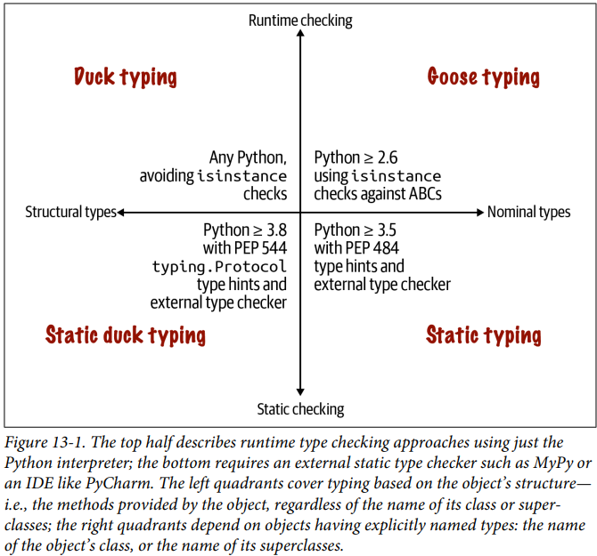
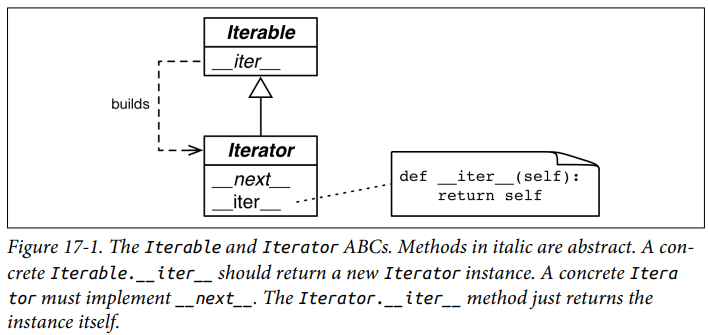

## CONTROL FLOW

### IF STATEMENT
```python
x = int(input("Please enter an integer: "))
if x < 0:
    x = 0
    print("Negative changed to zero")
elif x == 0:
    print("Zero")
elif x == 1:
    print("Single")
else:
    print("More")
```
- When comparing the same value to several constants use `match` statement

### FOR STATEMENT

- Iterates over the items of any sequence in the ordre that they appear
```python
words = ["cat", "windows", "defenestrate"]
for w in words:
    print(w, len(w))
```

- Iterate over a copy of a collection if you want to modify the original
```python
users = {"Hans": "active", "Elenore": "inactive", "asdf": "active"}

for user, status in users.copy().items():
    if status == "inactive":
        del users[user]

active_users = {}
for user, status in users.items():
    if status == "active":
        active_users[user] = status
```

### FUNCTIONS

- Default arguments
```python
def ask_ok(prompt, retries=4, reminder="Please try again!"):
    while True:
        reply = input(prompt)
        if reply in {"y", "ye", "yes"}: # to check if a value exists in sequence
            return True
        if reply in {"n", "no", "nop", "nope"}:
            return False
        retries = retries - 1
        if retries < 0:
            raise ValueError("Invalid User Response")
        print(reminder)

def f(a, L=[]):
    L.append(a)
    return L
def g(a, L=None):
    L.append(a)
    return L
print(f(1), g(1)) # [1], [1]
print(f(2), g(2)) # [1, 2], [2]
print(f(3), g(3)) # [1, 2, 3], [3]
```

- Keyword arguments (Named parameters)
```python
def parrot(voltage, stage="a stiff", action="voom", type="blue"):
    pass
# keyword argument should be after a keyword arguments
parrot(voltage=5.0, "dead")

# *name receives a tuple containing the positional argument beyond the formal parameter
# **name recieves a dictionary containing the keyword arguments beyond the formal parameter
# *name should be before **name
def cheeseshop(kind, *argument, **keywords):
    pass
```

- Special Parameters
```python
def f(pos1, pos2, /, pos_or_key1, pos_or_key2, *, kwd1, kwd2):
    pass

"""
pos1, pos2 - Positional arguments
pos_or_key - Positional or keyword argument
kwd1, kwd2 - Keyword arguments
"""
```

- Arbitrary Argument List - Before the variable number of arguments any number
of normal arguments may occur. They usually will be the last in the list of
formal parameters, because they scoop up all remaining input arguments that are
passed to the function. Any formal parameters after `*args` are keyword-only
argumet
```python
def concat(*args, sep="/"):
    pass


```

### FUNCTION ANNOTATIONS

```python
def f(ham: str, eggs: str = "eggs") -> str:
    print("Arguments: ", ham, eggs)
    return ham + " and " + eggs
```

## PYTHON DATA MODEL

- How does Python perform operations on objects?
    - By invoking special methods

- What is the syntax of special methods?
    - Leading and trailing double underscores (referred to as dunder methods)
    - For eg. in order to evaluate `my_collection[key]` the interpreter calls `my_collection.__getitem__(key)`

- What is an iterable?
    - An object capable of returning its methods one at a time. 

## ARRAY OF SEQUENCES

- What are the sequence types in Python?
    - Container type
        - Can hold items of different types, including nested containers. For
        eg. list, tuple, collections.deque
        - Holds references to the objects it contains
    - Flat type
        - Hold items of a single type. For eg. str, bytes, array.array
        - Stores the value of its contents in its own memory space
        - More compact, but limited to holding primitive machine values like
        bytes, integers, floats

- How are Python objects stored in memory?
    - Every Python object in memory has a header with metadata (to store the
    object's type, and the object's reference count)

## LISTS

- What is a list?
    - It is a sequence type
    - Comma-separated values between square brackets
    - Can contain heterogeneous data types

- 

## A PYTHONIC OBJECT

- User defined types can behave as naturally as the built-in types without
inheritance. You just need to implement the methods needed for your objects to
behave as expected. This approach is in abiding by duck typing principles

### OBJECT REPRESENTATIONS

- Python has two methods for getting a string representation from any object
    - `repr()` - To get output in Python console using `__repr__` method
    - `str()` - To get output like in `print()` using `__str__` method

### VECTOR CLASS REDUX

```python
v1 = Vector2d(3, 4)
# Direct access to components as attributes - no getter method calls
print(v1.x, v1.y)               # 3.0 4.0

# Unpacking to a tuple of variables
x, y = v1
x, y                            # (3.0 4.0)

# repr of a Vector2d should emulate the source code for constructing the object
v1                              # Vector2d(3.0 4.0)

# Supports comparison using ==
v1_clone = eval(repr(v1))
v1 == v1_clone                  # True

# str of a Vector2d produces an ordered pair display
print(v1)                       # (3.0 4.0)

# __abs__ method to return magnitude of the Vector2d
abs(v1)                         # 5.0

# __bool__ method to return False for a Vector2d of zero magnitude, otherwise
# True
bool(v1), bool(Vector2d(0, 0))  # (True, False)
```
- To achieve these properties, we can define Vector2d class as 

### classmethod VERSUS staticmethod

- `classmethod` decorator is used to define a method that operates on the class
and not on instances. It changes the way the method is called, so it recieves
the class itself as the first argument, instead of an instance. Its most common
use is for alternative constructors. It is used quite often

- `staticmethod` decorator changes a method so that it receives no special first
argument. It is just like a plain function that happens to live in a clas body,
instead of being defined at the module level. It is not very useful

```python
class Demo:
    @classmethod
    def klassmeth(*args):
        return args

    @staticmethod
    def statmeth(*args):
        return args

print(Demo.klassmeth(), Demo.klassmeth("spam")) # Demo.klassmeth receives Demo
# class as the first argument
# ((<class "__main__.Demo">,), (<class "__main__.Demo">, "spam"))

print(Demo.statmeth(), Demo.statmeth("spam"))   # Demo.statmeth behaves like a
# plain old function
# ((), ("spam"),)
```

### FORMATTED DISPLAYS

- The f-strings, the `format()` built-in function, and the `str.format()` method
delegate the actual formatting to each type by calling their `.__format__(spec)`
method. The `spec` is a formatting specifier which is either:
    - The second argument in `format(my_obj, spec)` or
    - Whatever appears after the colon in a replacement field delimieter with {}
    inside an f-string or `fmt` in `fmt.str.format()`
```python
brl = 1 / 4.82  # BRL to USD currency conversion rate
f`1 USD = {1 / brl:0.2f} BRL`   # Format specifier spec is 0.2f; 
```

- If f-strings, format(), and str.format() are new to you, classroom
experience tells me it’s best to study the format() built-in function
first, which uses just the Format Specification Mini-Language.
After you get the gist of that, read “Formatted string literals” and
“Format String Syntax” to learn about the {:} replacement field
notation, used in f-strings and the str.format() method (includ‐
ing the !s, !r, and !a conversion flags). F-strings don’t make
str.format() obsolete: most of the time f-strings solve the prob‐
lem, but sometimes it’s better to specify the formatting string else‐
where, and not where it will be rendered.

- If a class has no `__format__`, the method inherited from object returns
`str(my_object)`

### A HASHABLE Vector2d

- To put Vector2d instances in a set, they have to be hashable. To do so, we
must implement `__hash__` and `__eq__` and make vector instances immutable (by
making x and y components read-only properties)
```python
class Vector2d:

    def __init__(self, x, y):
        # 2 leading and 0/1 trailing underscores to make attributes private
        self.__x = float(x)
        self.__y = float(y)

    # @property decorator marks the getter method of a property
    @property
    # getter method is named after the public property it exposes
    def x(self):
        return self.__x

    @property
    def y(self):
        return self.__y

    # Every method that just reads the x, y components can stay as it was,
    # reading the public properties via self.x and self.y instead of the private
    # attributes
    def __iter__(self):
        return (i for i in (self.x, self.y))

    # It should return an int and use the same attributes as used in __eq__
    # method as object that compare equal should have the same hash
    def __hash__(self):
        return hash((self.x, self.y))
```

### SUPPORTING POSITIONAL PATTERN MATCHING

- To make Vector2d work with positional patterns, we need to add a class
attribute named `__match_args__` listing the instane attributes in the order
they will be used for positional pattern matching
```python
class Vector2d:
    __match_args__ = ("x", "y")
    # futher code

def positional_pattern_demo(v: Vector2d) -> None:
    match v:
        case Vector2d(0, 0):
            print(f"{v!r} is null")
        case Vector2d(0):
            print(f"{v!r} is vertical")
        case Vector2d(_, 0):
            print(f"{v!r} is horizontal")
        case Vector2d(x, y) if x == y:
            print(f"{v!r} is diagonal")
        case _:
            print(f"{v!r} is awesome")
```

### COMPLETE LISTING OF Vector2d

- You should only implement these special methods as per the application needs.
End users don't care if the objects that make up the application are "Pythonic"
or not. If your classes are part of a library for other Python programmers, you
can't really guess what they will do with their objects, and they may expect
more of the "Pythonic" behavior we are describing

## INTERFACES, PROTOCOLS AND ABCS

- What are the different types of typing?
    - Duck typing
    - Goose typing - Runtime checks of objects against ABCs
    - Static typing - Enforced by external type checkers and `typing` module
    - Static duck typing - Also enforced by external type checkers and the
    `typing.Protocol` subclasses


- Implementing `__getitem__` is enough to allow retrieving items by index, and
also to support iteration and the `in` operator

- A sequence should also support `len()` by implementing `__len__`. But we don't
need to implement a full protocol. It is Ok to implement only part of it

- What are the types of protocols in Python?
    - Dynamic protocol - Implicit, defined by convention. An object may
    implement only par
    - Static protocol - Has an explicit definition as a `typing.Protocol`
    subclass. 

### PROGRAMMING DUCKS

- What are certain examples of Dynamic Protocols?
    - Sequence
    - Iterable

### GOOSE TYPING

- Python doesn't have `interface` keyword - We use Abstract Base Classes (ABCs)
to define interfaces for explicit type checking at runtime, also supported by
static type checkers
- Goose typing is a runtime type checking approach that leverages ABCs.


## ITERATORS, GENERATORS, AND CLASSIC COROUTINES

- What does an iterator do?
    - If data doesn't fit in memory we need to fetch the items lazily (one at a
    time and on demand). This is done by an iterator

- What is an iterable?
    - An object that provides an iterator
    - For eg. every standard collection, and all sequences

- 
- Being an iterable `Sentence` objects can be used to input to build lists and
other iterable types. But it is also a sequence so we can get words by index

### WHY SEQUENCES ARE ITERABLES - THE ITER FUNCTION

- What is the internal mechanism of iterating over an object?
    - Whenever Python needs to iterate over an object x, it automatically calls
    `iter(x)`, which in turn:
        - Checks whether the object implements `__iter__` and calls that to
        obtain an iterator
        - If `__iter__` is not implemented, but `__getitem__` is, then `iter()`
        creates an iterator that tries to fetch items by index, starting from 0
        - If that fails, Python raises `TypeError`

- Why are Python sequences iterables as well?
    - By definition Python sequences implement `__getitem__`
    - However `__iter__` should be implemented as well
    - An object is considered an iterable not only if it implements `__iter__`
    but also if it implements `__getitem__`

- Why does object not implementing `__iter__` return `False` when tested against
`abc.Iterable`
    - In goose-typing approach, an iterable should implement `__iter__` method

- How to check if an object is an iterable or not?
    - If iteration is attempted on a non-iterable, Python raises a `TypeError`
    exception
    - If you are going to iterate over the object just after a check then just
    iterate over the object in a `try/except` block instead of doing an explicit check using `isinstance(x, y)`
    - If you are holding onto a value to iterate over it later on - then do a
    check by calling `iter()` on that object so that it considers both the 
    `__iter__` and `__getitem__` methods

- How to create an iterator from a function or callable object?
    - Call the `iter()` with two arguments
        - The first must be a callable to be invoked repeatedly (with no
        arguments) to produce values
        - Second arguments is a sentinal, which when returned by the callable,
        causes the iterator to raise `StopIteration`


### ITERABLES VERSUS ITERATORS

- What happens behind the scenes when we iterate over an iterable in Python?
    - When iterating over an iterable, behind the scene an iterator is in action


- What functions do iterators and iterables implement?
    - 

- How to check if an object is an Iterator, or a subclass of Iterator?
    - If the methods `__iter__` and `__next__` are implemented in a class, then
    it becomes a virtual subclass of `Iterator`
    - The `__subclasshook__` uses this logic to check presence of these methods
    - To check for possible instance use `isinstance(x, abc.Iterator)`

### CLASSES WITH __ITER__

- 
- 
    - The iterator here is a generator object, built automatically when the
    `__iter__` method is called, because `__iter__` is a generator function

- How a generator works?
    - Any Python function that has the `yield` keyword in its body
    - It produces a generator iterator when called
    
- 