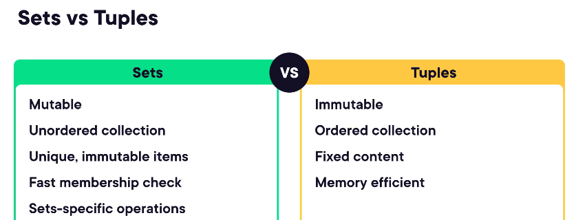

# [PYTHON PERFORMANCE](https://app.pluralsight.com/library/courses/python-3-performance/)

## COURSE OBJECTIVES

- MEASURING PERFORMANCE OF PYTHON APPLICATIONS (BASELINING)
- WRITE FASTER PYTHON CODE (WITH CORRECT DATA STRUCTURES)
- GAIN PERFORMANCE (CONCRETE TACTICS)
- SPEED UP PYTHON APPLICATIONS (USING `threads`, `asyncio`, etc)

## STRATEGY TO IMPROVE PERFORMANCE

- PREVENT
	- REVIEW ARCHITECTURE OF APPLICATION (SO IF APPLICATION NEEDS TO GET SAME DATA FROM A DATABASE MANY TIMES, USE A CACHING MECHANISM TO SPEED UP THE APPLICATION)
	- PERFORMANCE IMPLICATIONS ARE TO BE KEPT IN MIND WHEN WRITING CODE
	- USE EFFICIENT LIBRARIES (AND DON'T REINVENT THEM), DATA STRUCTURES, AND ALGORITHMS
- FIX
	- FIGURE OUT IF THE APPLICATION IS THE BOTTLENECK (IT CAN BE THE DATABASE, OR SOME OTHER TECHNOLOGY IN THE STACK)
	- TRY FASTER HARDWARE AS A FIRST STEP AND IF SHORT ON TIME
	- ENSURE TEST COVERAGE TO AVOID RISK OF BREAKING EXISTING CODE
	- THERE ARE TRADEOFFS TO THIS - CODE MAY REQUIRE MORE EFFORT, BECOME HARDER TO UNDERSTAND, AND CONSUME MORE MEMORY - SO THERE SHOULD BE A BALANCE
- MEASURE
	- WITHOUT MEASURING WE CAN'T DETERMINE IF OUR APPLICATION IS FASTER, AND HELPS KEEP TRACK OF FUTURE DEGRADATIONS
	- HELPS US TO DETERMINE BOTTLENECKS IN THE SYSTEM
	- SHOULD BE REPEATED MULTIPLE TIMES WITH VARIOUS INPUTS FOR ACCURATE MEASUREMENTS

## BASIC WAYS TO MEASURE PERFORMANCE

- OS TOOLS - TASK MANAGER (WINDOWS), SYSTEM MONITOR
- LINUX SPECIFIC COMMAND LINE TOOLS - `time` (MEASURES COMPLETION TIME OF AN APPLICATION), `top` (RESOURCE UTILIZATION)

`time python -c "for _ in range(100_000_000): pass"`

- PYTHON CODE - `time()` (RETURNS CURRENT TIME - SO RESULTS FETCHED TWICE CAN GIVE US THE TIME INTERVAL OF THE SOLUTION), `timeit` MODULE (MEASURES EXECUTION TIME OF PYTHON CODE SNIPPETS), `pytest-benchmark` PLUGIN FOR `pytest` (INTEGRATE PERFORMANCE MEASUREMENTS IN TEST SUITES FOR WARNINGS ABOUT SLOW CODE)
- THESE ARE ALL WORK WITH SMALL PIECES OF CODE, AND CANNOT SCALE UP TO APPLICATION CODE WHICH IS A LOT MORE

## PROFILING

- TO GET DETAILED PERFORMANCE MEASUREMENTS
- USED TO FINDING BOTTLENECKS IN AN APPLICATION - WITH DETAILED EXECUTION TIME MEASUREMENT (SUCH AS HOW MUCH TIME A FUNCTION NEEDS AND HOW OFTEN A FUNCTION IS CALLED)
- TYPES OF PROFILERS:
	- EVENT BASED (DETERMINISTIC):
		- GATHER DATA ON ALL EVENTS WHEN RUNNING CODE (WHICH FUNCTION ARE CALLED AND HOW MANY TIMES)
		- PRODUCE LOT OF DATA
		- HIGH ACCURACY
		- HIGH OVERHEAD (CAN BE WORKED WITH IN DEVELOPMENT ENVIRONMENT, BUT NOT IN PRODUCTION ENVIRONMENT)
	- STATISTICAL:
		- MEASURE PERFORMANCE BY SAMPLING THE PROGRAM (MEASURE PERFORMANCE PERIODICALLY)
		- GOOD ENOUGH RESULTS
		- LESS DATA
		- LESS OVERHEAD
- EVENT BASED PROFILERS IN PYTHON - `profile` MODULE (WRITTEN IN PYTHON AND HAS LOTS OF OVERHEAD), `cProfile` MODULE (WRITTEN IN C, LESS OVERHEAD WHEN COMPARED TO `profile`). OUTPUT CONTAINS NUMBER OF CALLS TO A FUNCTION, TOTAL TIME OF A FUNCTION EXECUTION, PER CALL EXECUTION TIME, CUMULATIVE TIME (FUNCTION EXECUTION + ANY FUNCTION CALL EXECUTION TIME)
`python -m cProfile <program_name>`
- TO OVERCOME LIMITATIONS OF PRE-INCLUDED PROFILERS:
	- PROFILE ONLY PARTS OF THE CODE INSTEAD OF THE WHOLE APPLICATION
	- CANNOT RUN ON MULTI-THREADED APPLICATIONS (WE WOULD HAVE TO RUN THE PROFILER ON EACH THREAD, WHICH IS A HASSLE)
	- VISIBILITY INSIDE FUNCTIONS IS LIMITED AS TO WHAT HAPPENS INSIDE THE FUNCTION (WE CAN OVERCOME THIS BY REFACTORING THE FUNCTION INTO MORE FUNCTIONS)
	- MEMORY CONSUMPTIONS STATISTICS ARE NOT TRACKED BY PROFILERS
- THIRD PARTY PROFILERS - `line_profiler`, `memory_profiler`
- TO VISUALIZE PROFILING DATA FOR LARGE APPLICATIONS:
	- `memory_profiler` HAS INBUILT MEMORY CONSUMPTION GRAPHS
	- `snakeviz` FOR `cProfile`

## DATA STRUCTURES

- DATA STRUCTURES IN PYTHON:
	- LISTS - HOLDS A BUNCH OF ITEMS TOGETHER
		- ORDERED COLLECTION OF ITEMS
		- HETEROGENEOUS TYPES (WITH HOMOGENEOUS TYPES PYTHON CAN PERFORM OPTIMIZATIONS UNDER THE HOOD)
		- IMPLEMENTED AS RESIZABLE ARRAY
	- ARRAYS
		- BUILT IN ARRAYS MUST BE IMPORTED FROM THE `array` MODULE. OFFER COMPACT DATA STORAGE IN MEMORY, BUT CAN STORE FEW TYPES OF DATA
		- `numpy` ARRAYS ARE OPTIMIZED FOR NUMERIC COMPUTATION AND CAN STORE ITEMS OF DIFFERENT TYPES
	- DICTIONARY - HOLDS A BUNCH OF KEY-VALUE PAIRS
	- SETS - HOLDS UNIQUE ITEMS
		- UNORDERED COLLECTIONS
		- ALL ITEMS MUST BE IMMUTABLE (FOR EG. LISTS CANNOT BE ADDED TO SET)
		- SETS ARE MUTABLE
	- TUPLES
		- IMMUTABLE LISTS (READ ONLY LIST)
		- LIGHTWEIGHT COMPARED TO LISTS
		- FASTER THAN LISTS, BUT OFFER LESS FEATURES
	
	
- DATA STRUCTURE OPERATIONS:
	- ADDING A NEW ITEM
	- FINDING IF ITEM IS IN A SET
	- DELETING AN ITEM
- BIG O NOTATION
- 